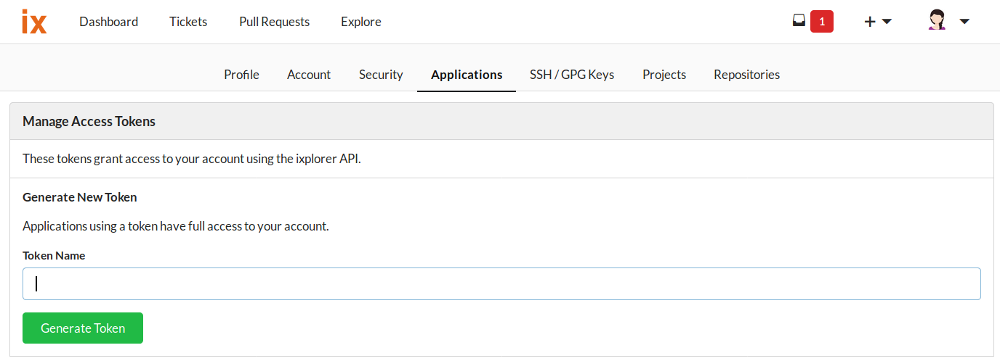
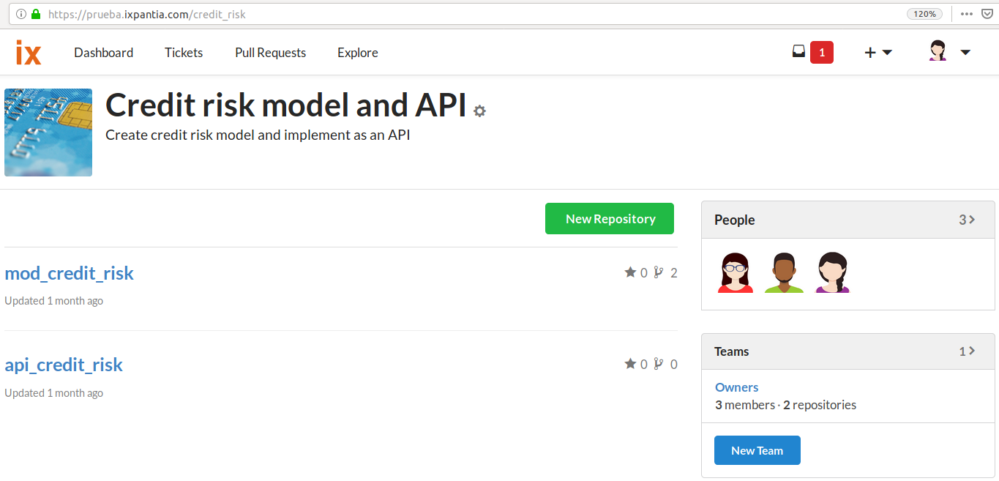
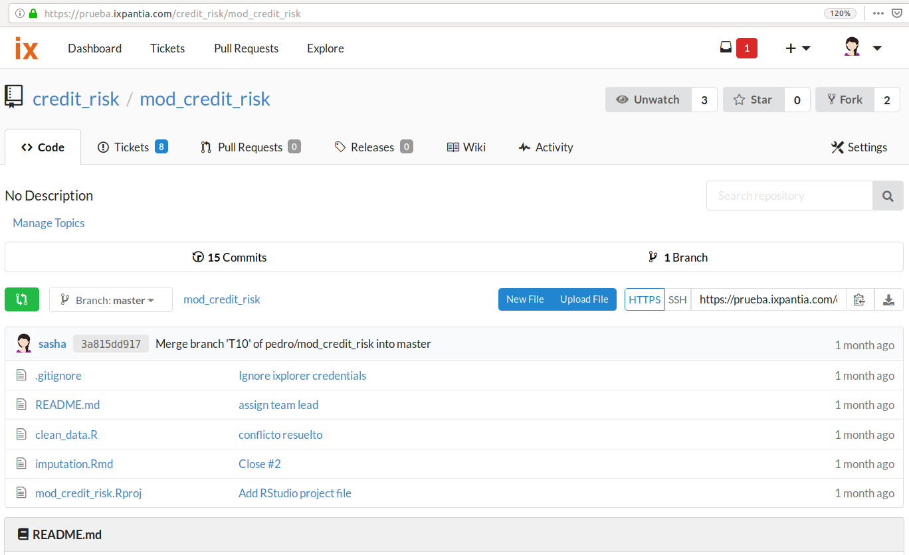
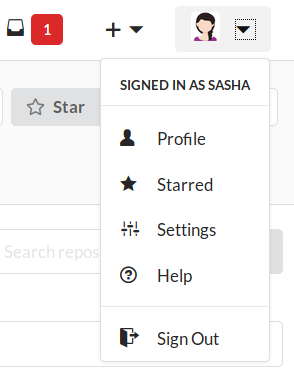

```{r setup, include = FALSE}
knitr::opts_chunk$set(
  collapse = TRUE,
  comment = "#>"
)
```

# **Where can I get my credentials?**

If you are wondering where you can get your API token or you are not sure about
the url, name of the upstream project, the ixplorer repository name or the 
user name, this vignette will show how to get them.

## Getting the API token
The first thing you should do is to go to the **settings** option that it's 
below your account avatar. 


Once there, there is a tab with the **applications** name on it. Click there 
and you will hace the option to generate an API token. You have to put a name
to your token and then create it.



After you click on **Generate token** you will see a large number that it's
the API token. Please make sure to save this, it's the credential that you will
need to put on your **Authentication gadget** to access the data of your
repositories from RStudio.


## Getting your ixplorer url
This is an easy one because you just need to search for your ixplorer 
environment on internet and paste the url. Just add a **/** at the end of the 
url.

As an example, the credential ixplorer url from the image below would be:

 - https:://prueba.ixpantia.com/
 


## Name of the upstream projet
This is the name of the project where your repository of interest it's related.
You have to be careful to write the name of the upstream project as it appears
on the url. For example, in the image below we can see that the name of the
project is **Credit risk model and API** and it has two repositories under it.

But the actual name of the project its abbreviated and it is the one that
appears on the url as **credit_risk**. This one is the piece needed to access 
your data through your ixplorer gadgets.



## Repository
When you start a session, basically you are going to work focused on one
repository. If we continue with the example, we saw two repositories under the
_Credit risk model and API_: **mod_credit_risk** and **api_credit_risk**.

If we want to work on the **mod_credit_risk** we have to write this name on the
authentication gadget.



## User name
This is just the same user name that you use to access to your ixplorer 
environment. On this example case it would be **sasha**



##  How the authentication gadget would look like?

Finally, to confirm all the steps, the authentication gadget with the
credentials we look for would like this:


