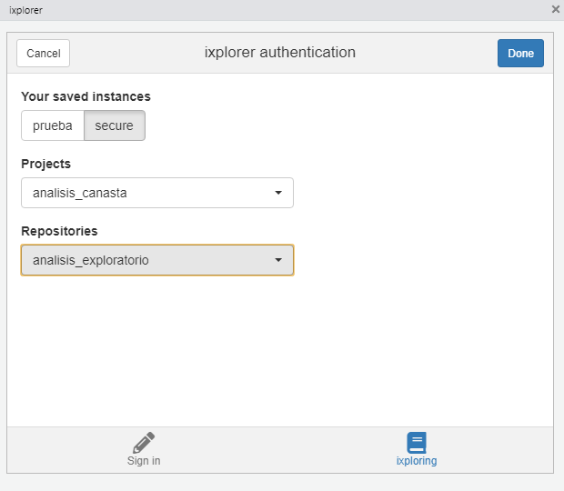
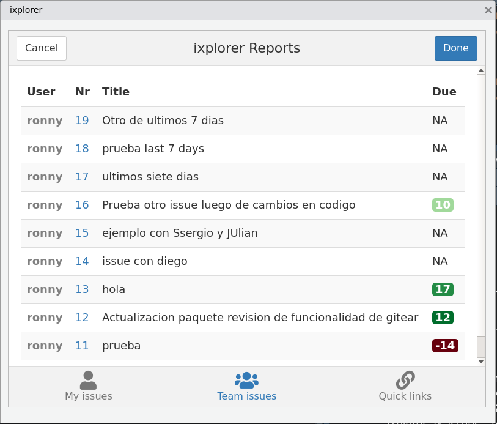
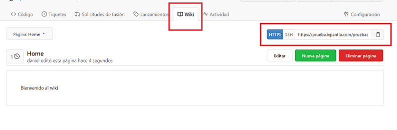

```{r setup, include = FALSE}
knitr::opts_chunk$set(
  collapse = TRUE,
  comment = "#>"
)
```
This vignette has the purpose of showing how to work with ixplorer in more
in-depth manner.

## About this package

In a developers workflow we are often in contact with an internet git service.
There we keep our code in repos but, most importantly, we communicate with our
team and build collaborations in an organized and effective way. However, we
also spend a lot of time in an IDE such as RStudio. This raises the need for a
channel that allows us to communicate with our team without having to leave our
working space.

The ixplorer package aims to improve communication in this way by been a
channel where we collaborate with our team in the git service but without
stoping our coding. 

[Gitea](https://gitea.io/en-us/) is an open-source software package for hosting
software development version control using Git. This package uses shiny gadgets
and the [gitear](https://github.com/ixpantia/gitear) package. Together, these
allow taking a quick look at your tickets in your gitea instance and even
create one easily while you are coding.

## ixplorer gadgets

ixplorer gadgets are a way to create and review tickets for your project
without having to exit RStudio and more importantly: without having to
interrupt your workflow.

### How to use the ixplorer gadgets?

Fistly, we need to install the ixplorer package

```{r, eval = FALSE}
devtools::install_github("ixpantia/ixplorer")
library(ixplorer)
```

When we are ready with the installation we can see three options in the
*Addins* menu under the IXPLORER header

- Authentication
- Create tickets
- Current tickets


#### Authentication gadget

This is the first step to be able to generate tickets or review them within
your repository for a given project. You will need an API token (which will be
provided by your project management). This gadget can be also accessed by
running add_token() alone.

##### The sign-in tab

The authentication gadget has two tabs, the first is the sign in tab, where you
will save you credentials for the first time. It looks like this:


In the **ixplorer URL** segment you need to make sure to include the internet
address of your ixplorer repository. should be similar to
`https://ixplorer_name.ixpantia.com`

Next you will need to enter your **access token**, which you will get from you
ixplorer enviroment or your git self hosted service. Similarly the **username**
is the same you use to enter your ixplorer enviroment. If you need more
information on how to get your credentials, there is a "credentials" vignettes
that further addresses this question.

The next step is to fill in the name of the **upstream project**. This is the
project where the source version of your repository resides. From this source,
you and other team members will have forked and cloned the repository to
generate changes and propose them as merge requests. in the flow of job, all
tickets are handled centrally in the project **upstream**. Any ticket that is
generated on your personal fork, does not will be displayed through the
ixplorer gadget (and in general we do not recommend work with personal tickets)

In the **ixplorer repository name** segment please type the name of the
specific repository on which you want to work in the active session of the
RStudio project.

Additionally, the authentication gadget has an optional space for to choose
your preferred **language**. Later gadgets will be displayed always in the
language of your choice.

###### Passwords

Once the "done" button is pressed on the top right part of the gadget, you may
be prompted to set a password. This password may be required the next time you
start a new session and want to get information about this specific instance,
for example your open tickets. Therefore it is important to store this password
in a safe place, preferably an appropriate password manager. The password promt
will look like this:


Next time you start a new session and use a function the ixplorer package a
similar window will be displayed. This time, however, you will need to enter
the password you previously established during the authentication and not a new
password. Your passwords are stored safely using the keyring package.


##### The ixploring tab

If you have previously saved your credentials for any instance you can go
directly to the "ixploring" tab inthe gadget. Here you will be given the option
to choose the instance in which you want to work, then the option to choose
between the projects of that instance and finally the repositories.



Be careful in this step if you are working on the computer of someone else,
since your authentication data will be stored in that computer. So if you are
going to work on someone else's computer or on a shared computer, it is best to
use the function delete_credentials() at the end of your working session to
delete your computer credentials completely.

#### Create tickets gadget

At this point you should have completed the authentication process. Yes this is
correct you will be able to create a ticket without having to exit RStudio!

If everything is correct, you will see the **ticket title** section and
**Description**. If not, you will see a warning text mentioning what it is
missing. This gadget works on the last instance that you have saved in the
authentication gadget. A message such as "you are currently on test instance"
appears on your console so you can make sure you are creating the ticket in the
proper repository. this window will appear in the language you have saved in
the authentication gadget


#### Current tickets

This gadget is designed to give you a quick glance at active tickets and their
status. You will also find links that will take you to the ixplorer if you want
to review details such as comments or make changes to tickets such as
assignment deadlines.

###### My tickets tab

In the first tab **My tickets** you can find the tickets assigned to you with
the identification number that is also a link to the ticket in the ixplorer
environment. You will also see the column with the number of days remaining (in
green color) or days past the deadline (in red color).

This window works on the last instance you have saved in the authentication
gadget. A message such as "you are currently on the test instance" will be
printed to your console to help make sure you are seeing tickets from the
correct instance. To change the instance you can use the "ixploring" tab of the
authentication gadget. This window will appear in the language that you have
previously selected.


###### Team tickets tab

In the second tab **Team ticket** you can review all tickets open files related
to the current project and assigned to all members of the team minus you. The
identification number is a link to the information of the ticket in the
ixplorer environment and the "deadline" column is how many days are left (in
green) or how many days have been exceeded (in red) with regarding the
deadline. Note that this gadget just shows you the tickets that have an
assignee, otherwise, the tickets do not show here.



###### Quick links tab

Finally the **Quick Links** tab has the links to the components main files of
the project repository, so you don't have to write much in your web browser to
find a specific address.

These links will allow you to more quickly find details
specific to your project repository such as closed tickets, milestones, the
wiki or the project site where other relevant repositories are located.


## Other usefull functions

Apart from the gadgets, ixplorer offers the following functions to obtain
information.

### Your tickets in tibbles

* **list_open_tickets()**: Returns a tibble with its open tickets. This tibble
  has the ticket number, the ticket title and the milestone it belongs to. It
  uses, by default, the last instance you saved in the authentication gadget.
  However, you can specify the desired instance using the "instance" variable
  within the function. You can also specify the number of days backwards from
  where you want to get the tickets.

* **list_closed_tickets()**: Returns a tibble with the closed tickets of a
  repo. This tibble has the ticket number, the ticket title and the milestone
  it belongs to. It uses, by default, the last instance you saved in the
  authentication gadget. However, you can specify the desired instance using
  the "instance" variable within the function. You can also specify the number
  of days backwards from where you want to get the tickets.

* **list_open_pr()**: Returns a tibble with your open pull requests. By default
  this function searches in all your saved ixplorer instances for pull requests
  assigned to you. However, both the instance and the assigned person can be
  specified.

### Making version control easier

During git version control, we often perform certain tasks that require
repetitive commands. The following functions are intended to convert this in
one step.

* **synch_branch()**: Allows you to update your master branch from your
  upstream automatically by a rebase. It does the steps we usually use, fetch
  upstream, checkout master, rebase upstream/master, and push.

* **add_upstream()**: Allows you to include your upstream directly from your
  active repository in Rstudio. By default it takes the information from the
  last instance saved.

* **set_git_timeout()**: Allows you to specify the time you want to save your
  git credentials on your remote server. The default is 4 hours. The function
  takes its time in seconds.

#### Publishing on wiki
* **publish_wiki()**: Allows you to publish a wiki in your repo from an
  Rmarkdown. Wikis are especially important when you want to easily document
  what happens in the repository. To publish a wiki with publish_wiki(), the
  first step is to create the first page manually. This is accomplished in the
  "wiki" tab in the repository. The next step is to clone the wiki repository.
  This url to clone the wiki is different from the one we use to clone the
  repository where we find our code. Once we clone this repository we can use
  publish_wiki().




