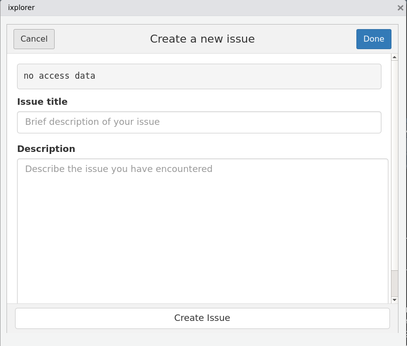

```{r setup, include = FALSE}
knitr::opts_chunk$set(
  collapse = TRUE,
  comment = "#>"
)
```

# ixplorer gadgets

ixplorer gadgets are a way to create and check your project issues without 
leaving RStudio and more important without interrupting your workflow.

# How to use the ixplorer gadgets

First you have to install your ixplorer package

```{r, eval = FALSE}
install.packages("ixplorer")
```

When you are done with the installation, you are going to be able to see in
the *Addins* menu, under the IXPLORER title, three options:

 - Authenticate
 - Create issue
 - ixplorer issues
 


## Authenticate gadget

This is the first step in order to be able to create issues or check you project
issues with the ixplorer gadgets. You will need an API key (provided by your
project  manager).


At the **ixplorer url** make sure to include the web direction of your
ixplorer repository. It has to be similar to: _https://ixplorer_name.ixpantia.com/_

The the next step is to fullfill the name of the **upstream project**. This is the
project where the repository resides. A project can have several repositories. In
this case we just need the name of the project.

At the **ixplorer repository name** we have to write the name of the specific
repository where we are going to work

Finally we have the space for write our user name. In the section **ixplorer user name**  This is the same user name that we use to access to the ixplorer environment.

There is an option of a **persist token**. If we are working in our computer, we
can select this option. What this is going to do, is to keep all this authentication data for the next session we have. In this order we can avoid 
doing the authentication each time that we are going to work in the same
repository.

Be careful because if you`re working in somebodyelse computer, your personal
authentication data is going to be store in that computer. Avoid this action
leaving the option without a mark.

## Create issue gadget

At this point you should have all your authentication done. If that is correct
you are going to be able to create an issue without getting out of RStudio!

If everything is okay, you are just going to see the **issue title** and **Description** section. If not, you`re going to see a text warning you what is 
missing. 



In this gadget you can create an issue without loosing your workflow and ideas.
If you came up  with a new issue (wish/improvement/question) you can go to
Addins > Create issue and under the **issue title** write the title of your
new issue and under the **Description** section write your idea. 

This issue is going to appear on your ixplorer repository open issues.

## ixplorer issues

This gadget is designed to give you a quick view of the issues and their status
on your project repository. Also you wil find som quick links that will take you
to the ixplorer if you want to check something in more detail.

At the first tab **My issues**, you are going to be able to check the issues assigned to you with the number id that also is a quick link to the issue on 
your ixplorer and also you will see a column with the number of days left (on green) or days passed the due date (red)


On the second tab **Team issues** you are able to see all the open issues 
related to the project repository, not just the ones assigned  to you. The ID
number is a quick link to the complete issue on your ixplorer and the Due column
is the days left on green for the due date or red if the due date was missed.


Finally the **Quick links** you have the links to the principal components
of your project repository so you don't have to type to much in your browser to
find a specific direction.

This quick links will allow you to find faster specific details of your project
reposirtory as clossed issues, milestones, the wiki, or the project place where
all the repositories concerning to the project are.


 


