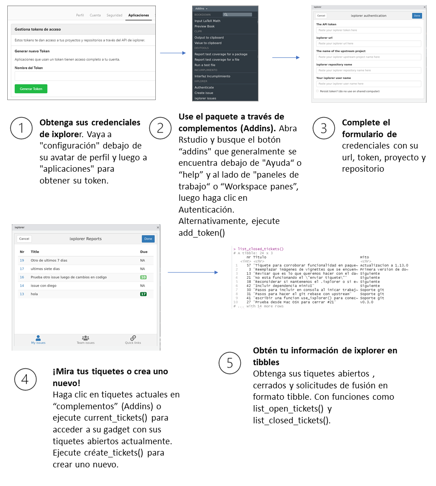

```{r, include = FALSE}
knitr::opts_chunk$set(
  collapse = TRUE,
  comment = "#>"
)
```


Esta viñeta tiene el propósito de mostrarle una descripción general rápida del flujo 
de trabajo con el paquete ixplorer. 

### Descripción general

El objetivo de este paquete es permitirle acceder
a la información desde el servicio  ixplorer de forma rápida y sencilla desde RStudio.
Esto significa que puede ver los tiquetes asignados a usted o 
a su equipo mientras escribe código, así como todos los tiquetes de su repositorio
y sus solicitudes de fusión abiertas.

Además, le permite realizar rápidamente algunas funciones diarias relacionadas con el
control de versiones de git, como actualizar la rama maestra de su bifurcación,
establecer un período de tiempo para mantener sus credenciales en un servidor remoto
y publicar un wiki más fácilmente. 

### ¿Cómo se utiliza ixplorer?

{width=90%}


El primer paso es obtener las credenciales de ixplorer, luego utiliza la función de 
autenticación para identificarse, con este paso está dando la información necesaria 
para que el paquete ixplorer pueda obtener sus tiquetes.

Si no es la primera vez que usa ixplorer, use la pestaña ixplorando en el dispositivo
de autenticación para moverse entre sus instancias guardadas y repositorios.

Una vez que haya terminado, puede eliminar sus credenciales si es necesario usando 
**delete_credentials()**. Esto se recomienda especialmente cuando se utiliza una 
computadora compartida.

### Funciones de ixplorer

En general, podrás:

* crear un ticket con crear_tiquete()
* mirar los tiquetes que te han asignado con tiquetes_actuales()
* obtener un tibble con los tiquetes abiertos y cerrados de un repo con
listar_tiquetes_abiertos() y listar_tiquetes_cerrados().
* obtener un tibble con sus solicitudes de fusión abiertas con list_open_pr().
* actualizar automáticamente tu rama maestra desde tu upstream con actualizar_rama().
* establecer un tiempo de espera para sus credenciales de git cuando esté trabajando en un servidor remoto
con fijar_tiempo_git().
* publicar fácilmente la wiki de su repositorio con publica_wiki().

### Viñetas

Visite las viñetas adicionales para obtener más información sobre cómo usar este paquete.

* La viñeta **ixplorer** brinda más información sobre el propósito y
funciones de este paquete.
* La viñeta de **credenciales** describe el proceso paso a paso para obtener sus credenciales de ixplorer.
* **diccionario** presenta términos comunes que se usan cuando se habla de control de versiones de git, como repositorio, proyecto, tiquete y solicitud de fusión. 
